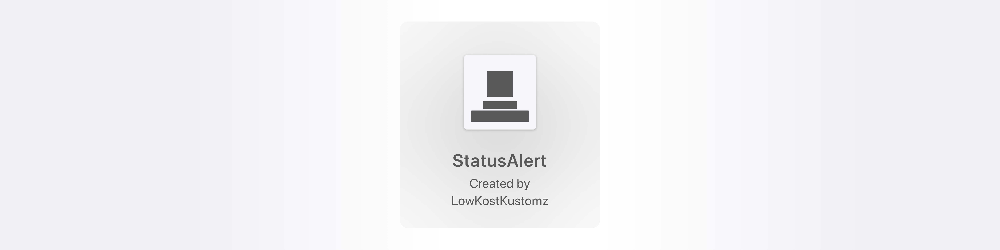
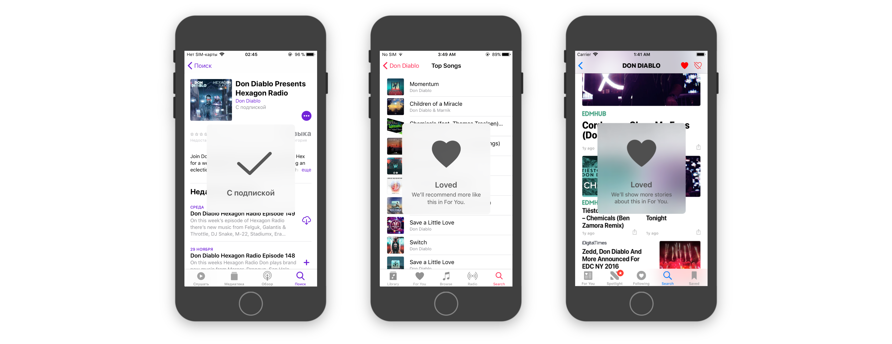
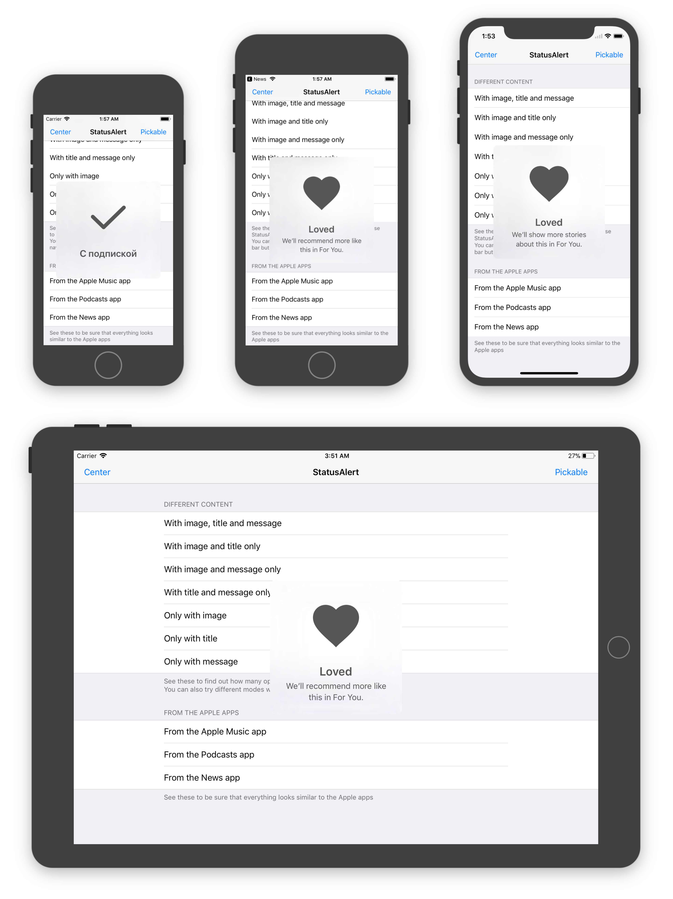
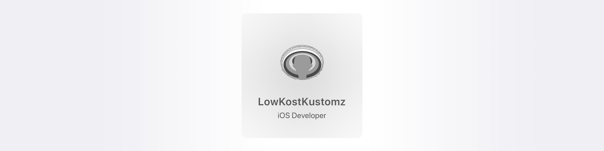

[]()
[](http://cocoapods.org/pods/StatusAlert)
[](https://github.com/Carthage/Carthage)
[](http://cocoapods.org/pods/StatusAlert)
[](http://cocoapods.org/pods/StatusAlert)

StatusAlert is an iOS framework that displays status alerts similar to Apple's system self-hiding alerts. It is well suited for notifying user without interrupting user flow in iOS-like way.

It looks very similar to the alerts displayed in Podcasts, Apple Music and News apps.

## Requirements

* Xcode 9.0 or later
* iOS 9.0 or later
* Swift 4.0

## Features

* System-like look and feel
* Safe Areas support
* Universal (iPhone & iPad)

## Installation

StatusAlert is available via CocoaPods and Carthage.

### CocoaPods

To install StatusAlert using [CocoaPods](http://cocoapods.org), add the following line to your `Podfile`:

```ruby
pod 'StatusAlert', '~> 0.9.2'
```

### Carthage

To install StatusAlert using [Carthage](https://github.com/Carthage/Carthage), add the following line to your `Cartfile`:

```ruby
github "LowKostKustomz/StatusAlert" ~> 0.9.2
```

## Demo

Demo application is included in the `StatusAlert` workspace. To run it clone the repo.

It shows how to:

* create different configurations of the alert
* present the alert on different vertical positions


## Usage

```swift
// Importing framework
import StatusAlert

// Creating StatusAlert instance
let statusAlert = StatusAlert
                    .instantiate(
                      withImage: UIImage(named: "Some image name"),
                      title: "StatusAlert title",
                      message: "Message to show beyond title",
                      canBePickedOrDismissed: isUserInteractionAllowed)

// Presenting created instance
statusAlert
  .show(in: viewShowAlertIn,
        withVerticalPosition: .center(offset: 0))
```
> All the alert components (`image`, `title`, `message`) are optional, but at least one should be present. Otherwise `show()` method will be ignored.
>
> **IMPORTANT**
>  > The alert must be presented only from the main thread, otherwise application will crash with an appropriate error.

## Customization

#### Different configurations

Present alert with any set of image, title and message

#### Vertical position

Display alert anywhere you want, either on the top, in the center or at the bottom of the view, and with any offset.

#### Appearance

You can customize a single alert's appearance via the `StatusAlert`'s properties

```swift
public var titleFont: UIFont
public var messageFont: UIFont
public var contentColor: UIColor
```
or for all alerts at once with `StatusAlert.Appearance`'s properties

```swift
public static var titleFont: UIFont
public static var messageFont: UIFont
public static var contentColor: UIColor
```

#### Dismissal

Alert will hide itself after 2 seconds timeout.

You can also pass `canBePickedOrDismissed: true` into `StatusAlert`'s `instantiate` method. After that you will also be able to dismiss the alert manually by tap it and long tap the alert to delay dismissal.

## Apps Using _StatusAlert_

> Feel free to submit pull request if you are using this framework in your apps.

## Author


<!--****Yegor Miroshnichenko****-->

Feel free to contact me via:

* Twitter: 	[@LowKostKustomz](https://twitter.com/LowKostKustomz)
* Email:	[mierosh@gmail.com](mierosh@gmail.com)

## License

> StatusAlert is available under the MIT license. See the LICENSE file for more info.
